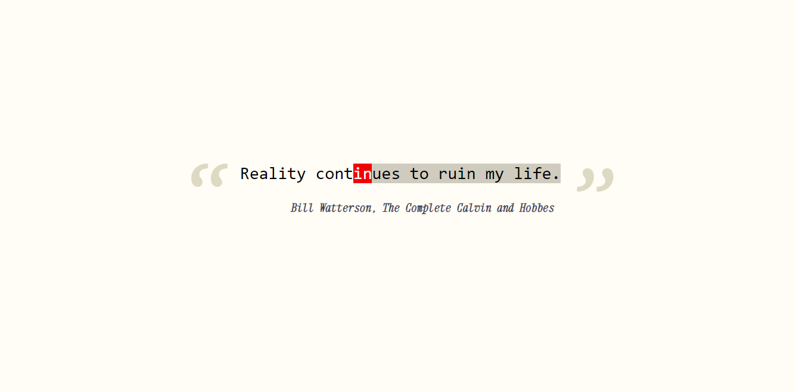
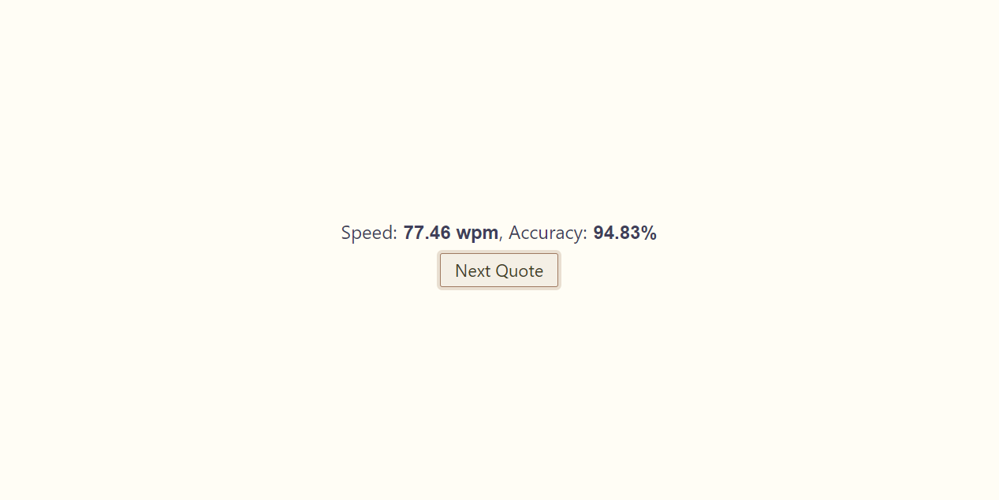

## An app in Django & React for improving your typing speed
This project is inspired by [Keybr](https://www.keybr.com/) and [Type Racer](https://play.typeracer.com/). It has 150 quotes shamelesly stolen from [GoodReads](https://www.goodreads.com/quotes).
When you open it and login, it pulls a random quote from the backend and waits for you to type it. 

After you done, it shows average typing speed (in [WPM](https://en.wikipedia.org/wiki/Words_per_minute)) and accuracy throughout the quote.

A lot of the React authorization was done following [these awesome tutorials](https://youtube.com/playlist?list=PL0Zuz27SZ-6PRCpm9clX0WiBEMB70FWwd&si=OPljuyeaaQPw3scj) by Dave Gray.

## Try it yourself:
I tested it on Node v16.14.0 and Python 3.9.2 but it will likely work on other versions too.
- Open the server dir and type:
    ```
    python3 -m venv venv
    source venv/bin/activate
    pip3 install -r requirements.txt
    python3 manage.py migrate
    python3 manage.py createsuperuser
    python3 manage.py runserver 8080
    ```

- In another terminal open client dir and type:
    ```
    npm install
    npm start
    ```